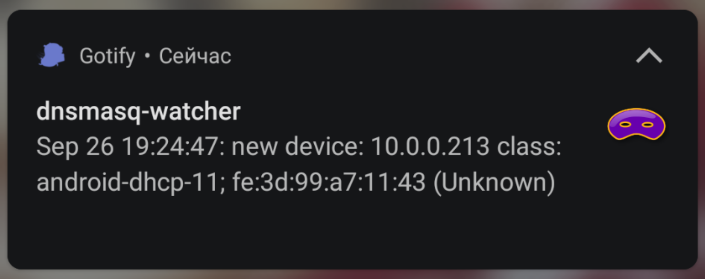

# dnsmasq-lease-notifier

Is a script for dnsmasq's `--dhcp-script` option. Its purpose is to notify you via [gotify](https://gotify.net/) if some unknown (that is, not in `/etc/hosts` or `dhcp-host`) host requests an ip in your network.



## Dependencies:
* [gotify/cli](https://github.com/gotify/cli)
* [choose](https://github.com/theryangeary/choose) and [ripgrep](https://github.com/BurntSushi/ripgrep)
* `http://standards-oui.ieee.org/oui/oui.txt` or [nmap](https://nmap.org) (optional, for vendor identification)

## Options:

The script is quite short, so i expect you to edit it appropriately if needed.

Points of interest:

### `DNS_LEASE_WATCHER_OUI_DB`

This is a path to the copy of http://standards-oui.ieee.org/oui/oui.txt, defaults to `/usr/local/share/oui.txt`

```sh
curl 'http://standards-oui.ieee.org/oui/oui.txt' | sudo tee /usr/local/share/oui.txt
```

### `DNS_LEASE_WATCHER_NMAP_DB`

Defaults to `/usr/share/nmap/nmap-mac-prefixes`

If both present, `oui.txt` is preferred since it should be more up to date.

## Setup

Download and install the script

```sh
curl -L \
  'https://raw.githubusercontent.com/MahouShoujoMivutilde/dnsmasq-lease-notifier/master/dnsmasq-lease-notifier.sh' |
  sudo tee /usr/local/bin/dnsmasq-lease-notifier.sh
```

Add

```sh
dhcp-script=/usr/local/bin/dnsmasq-lease-notifier.sh

```

to `/etc/dnsmasq.conf`

## Mobile notifications

In short:
1. setup [gotify/server](https://github.com/gotify/server) somewhere
2. in its webui create `dnsmasq watcher` app for your user, get its auth token
3. setup [gotify/cli](https://github.com/gotify/cli) with said token on your dnsmasq server
4. login in gotify on your phone
